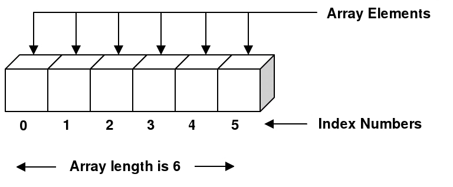

# Arrays

## Standards

<details>
  <summary>
    LF.3
  </summary>
  
  Understand that data structures are ways of storing multiple elements of associated data. Access individual elements within sets of information, either directly, by iteration, or using methods. 
</details>

<details>
  <summary>
  LF.3.a Arrays: 
  </summary>
  
  Understand the Array data structure. Know that Arrays stores values of the same type in an ordered list. Understand the following:
  * Access and modify arrays 
  * Iterate through arrays 
  * Use common array methods 
</details>

## Objectives
* Understand how to create an array, and why you'd want to. 
* Know basic array property length. 
* Know how to index/key into an array. 
* Know how to change the value of an element in an array if given the index. 
* Know how to iterate through an array with either manual accessing or loops.
* Know how to change the contents of an array. 
  * push 
  * pop 
  * unshift 
  * shift
  * splice
* Know basic accessor methods for useful array manipulation.
  * slice
  * concat
  * join
  * split
* Know what a multidimensional array is and how to index / key into it. 
* Know what destructuring assignment is and how to use it. 

## Lesson Overview
<details>
An array provides a convenient way to store a collection of **things**. Say we want to keep the numbers `2, 3, 5, 7, and 11` all in one place. Instead of creating five separate variables we can create an array to store all these values. To create an array, we use the `[` and `]` brackets, and in between put whatever values we need separated by commas. We can also call “new” on the Array class and pass in the elements desired.

```js
let arr = [2, 3, 5, 7, 11]

// OR

let arr = new Array(2, 3, 5, 7, 11)
```

Arrays allow programmers to store data in an easier, more concise way. By grouping similar bits of information together within an array, it helps better organize different data sets so we can work with it in one location rather than having to call different variables throughout our code.

One way we can think about arrays is as a row of **boxes**. Each box held within this row has a position of where it is located and contains a value inside of it. The **element** of an array is the *value* held in one of the boxes; and the **index** of an array talks about the *position* of where said box is. The below image better illustrates how you can visualize an array:



As you might notice there are 6 elements in the above array, but the index of an array starts counting from `0`; it's a common mistake for first-time programmers to forget that arrays start on index 0, so keep that in mind while you play around with arrays!

We can put any type of variable as an element of an array. We can even mix different types in a single array or put an *array itself* as one of the elements (we'll get into that more when discussing multi-dimensional arrays).

```js
let animals = ['cat', 'dog', 'raccoon']
let mixedArray = [2, 5, 'zebra', ["Can", "you", "believe", "it"]]
```

It is, however, **BEST** practice to use the same data type across all elements in the array. We want this container to be a representation of a group of data, like we talked about before; so mixing it up with different types of data proves cumbersome. It also makes it more difficult to keep track of what's been put in the array if the data is mixed up, so keep it consistent and understandable for yourself and other programmers. There are also other **Data Structures** (an array is an example of one "data structure") that can be utilized if we do need to mix different data types, but for arrays keep it simple and to one data type.

Arrays can be accessed like strings; as in, we can call various methods with arrays just like you can with strings. And like strings, you can access the `length` property of an array.

### Array Property `length`
We can access the first element of the array by using index `0`, and the last by using index `array.length – 1`

```js
let animals = ['cat', 'dog', 'raccoon', 'giraffe']

console.log(animals[0]) // this will print 'cat'
console.log(animals[animals.length -1]) // this will print 'giraffe'
```

Why `array.length – 1` you may ask? Well the `array.length` returns the amount of elements in an array, which when we normally start counting something we start at the number 1. But when the computer works with indexes, `0` is the starting place for the array. So we need to minus 1 or else we'll be one higher than the highest position of the array. This will cause an **Array Out of Bounds** error, and as you might guess that's a problem.
</details>

## Access and Modifying Arrays
We can modify array elements so long as we know the element and it's index we want to change:

```js
let animals = ['cat', 'dog', 'raccoon', 'giraffe']

// changing the second element to 'zebra'
animals[1] = 'zebra' // index 1 = second element

console.log(animals) // => [ 'cat', 'zebra', 'raccoon', 'giraffe' ]
console.log(animals[1]) // => 'zebra'
```

The `animals` array can be seen as a whole when we pass it to `console.log()` but we can also look at an individual element of an array when we use `animals[index]`, where `index` is the numbered index position we want to pass to the array.

We can also overwrite ALL the values of an array by passing a new array into it:

```js
let animals = ['cat', 'dog', 'raccoon', 'giraffe']

animals = ['horse', 'monkey', 'goose'] // passing a new array
console.log(animals) // => ['horse', 'monkey', 'goose']
```

There are more complex manipulations you can apply onto an array, but that will be discussed later on below with “accessor” and “mutator” methods. The most important part when working with arrays is *keeping track of indices*, since that's the thing that equates to the value you want to access when working with an array.

It's encouraged to play around with indices of arrays when first working with them. If you want, see what happens when you put an index of `-1`, or a number that's larger than the length of the index; experiment a little!

## Iterate through Arrays
The importance of indices lies with the prime feature you can do with arrays, iteration. **Iteration**, in programming, is when we apply step-by-step functions until a terminal point in a program is reached. Iterating through an array can be done “manually” (i.e. hard coded, or putting values directly) by putting the index number directly to return the elements you desire:

```js
let animals = ['cat', 'dog', 'raccoon', 'giraffe']

console.log(animals[0]) // => 'cat'
console.log(animals[1]) // => 'dog'
console.log(animals[2]) // => 'raccoon'
console.log(animals[3]) // => 'giraffe'
```

If you are aware of how **loops** work, we can also iterate on an array step-by-step automatically:
```js
let animals = ['cat', 'dog', 'raccoon', 'giraffe']

// the loop goes from 0 (first element) to animals.length - 1 (last element)
for(let i = 0; i <= animals.length – 1; i++) {	// i is our representation of index
	console.log(animals[i]);	// => 'cat', then 'dog', then 'raccoon', then 'giraffe'
}
// i will be 0, then 1, then 2...up to animals.length – 1 (the highest index); printing out the corresponding element to the index
```

You may be asking “Why would I print out all the values like that when I could just do `console.log(animals)`?” The main advantage of iterating through an array is that we can (1) make our code neater & more compact, (2) do special manipulations if we are looking for a particular value on an array or formatting desired outputs. The below code is checking for a particular element to appear using a loop to iterate through an array:

```js
let animals = ['cat', 'dog', 'raccoon', 'giraffe']

for(let i = 0; i <= animals.length – 1; i++) {
	if(animals[i] === 'dog') {
		console.log('Yay! There's a dog!')
	}
}
// this loop prints out 'Yay! There's a dog!' when the array contains 'dog', which it does!
```

Don't worry about loops right now if they're too confusing; there's a whole lesson dedicated on making loops more clear [here](https://github.com/joinpursuit/Pursuit-Core-Web/tree/master/fundamentals/loops). This example is just to introduce ideas about how you can access and iterate an array, loops being one of the most common methods programmers use for iteration.

Let's get back into just working with arrays for now with some various built-in methods that you can use to help when working with arrays.

## Common Array Methods
This section will be split up into two types of methods that were mentioned before, accessor and mutator methods. **Accessor methods** are functions *access* information out of an array, without changing the contents of the array; these methods will return either a single element, index, value, or a snippet of the array itself. **Mutator methods** are functions that we can apply onto an array that will change the content of the array; they essentially return a new representation of the array and *mutate* it from the original version. We'll be talking about mutator methods first, then accessor methods.

### Mutator Methods
#### Push
We can add elements to the end of an array by using the `push` method:
```js
let numbers = [2, 4, 6]

// you can add elements one at a time
numbers.push(8) // added 8; now numbers will be: [2, 4, 6, 8]

// or, you can also add multiple elements by adding more elements to push.
numbers.push(10, 12, 14) // added 10, 12, & 14; now numbers will be: [2, 4, 6, 8, 10, 12, 14]
```

#### Pop
We can remove an element from the end of an array by using the `pop` method:

```js
let numbers = [2, 4, 6]

numbers.pop() // removing the last element in the array
// now the array will be: [2, 4]
```

*Interesting Note*: the pop method returns the element that was removed from the array (which can be checked with `console.log(numbers.pop())`).

#### Unshift
To add an element to the beginning of the array use the method `unshift`.

```js
let numbers = [3, 5]
numbers.unshift(1)
// numbers is now: [1, 3, 5]
```

#### Shift
To remove an element from the beginning of the array use the method `shift`.
```js
let numbers = [3, 5]
numbers.shift()
// numbers is now: [5]
```

**Helpful Trick 1**: Sometimes it can be hard to remember which methods do what. Here's a helpful trick. Push and pop are fairly easy. Pushing into the array, and popping off. Now with shift and unshift try and remember that unshift is like push but at the beginning of the array. You can tell they are similar because they both have the letter 'u' in them. The ones with the 'u' add to the array, the other two are removing.

**Helpful Trick 2**: Another way you can remember how shift and unshift work is imagining the row of boxes on a conveyor line. The left side of the conveyor is empty space where boxes fall out of. Shift moves the conveyor left, and unshift the opposite direction, right. If you move the boxes left (shift) you'll be losing the box in the beginning of the row; if you move right (unshift) you'll have space on the conveyor line to put another box in place of the beginning of the row.

*(Either way, find the best way to remember these methods that works for you!)*

#### Splice
This last mutator method, `splice`, has multiple types of uses held within it. The basic form of this method takes a starting index as an argument and removes all array elements starting from that index.

```js
let arr = ['dog', 'cat', 'mouse']
arr.splice(1) // arr now contains ['dog']
```

The following are optional arguments you can add onto this method.
If specifying a 2nd argument, we can add a delete count to set a distance for how far to delete from:

```js
let arr = ['dog', 'cat', 'mouse']
arr.splice(1, 1)
// arr contains ['dog', 'mouse']
```

Any additional arguments to `splice` (after the first two) will be inserted into the array in place of the deleted ones.

```js
let arr = ['dog', 'cat', 'mouse', 'giraffe']

// removing 'cat' and 'mouse' and inserting 'fish'
arr.splice(1, 2, 'fish') // arr contains ['dog', 'fish', 'giraffe']

AND

let arr = ['dog', 'cat', 'mouse', 'giraffe']

// removing 'cat' and 'mouse' and inserting 'fish', 'octopus', & 'shark'
arr.splice(1, 2, 'fish', 'octopus', 'shark') // arr contains ['dog', 'fish', 'octopus', 'shark', 'giraffe']
```

Like the `pop` method, `splice` **returns** an array containing the elements that were removed; in case you needed to store that value or log what was removed.

You can think of the `splice` method as a combination of `pop`, `push`, `shift`, and `unshift`; where you have more control over where you can remove & add elements into the array for more complex manipulations. The other methods are still useful when we want to do more simple changes to the array we are working on, so don't forget about using them as well!

### Accessor Methods
Remember, these methods are just for accessing the information from the array; the results of these methods will need to be stored in another variable if we want to use them somewhere else in our code.

#### Slice
Arrays have a `slice` method that works by taking a slice of the array; a part of the whole array The method takes in two arguments. The first is the starting index (inclusive), the second argument is the ending index (exclusive). **Inclusive** will put the element on that index as part of the sliced array, and **exclusive** will not include that element (the element to the left of the second index argument is included in `slice`)

```js
let arr = [4, 6, 8, 10, 12]

// getting [6, 8, 10], arr will still be the same.
let sliceOfArr = arr.slice(1, 4) // sliceOfArr => [6, 8, 10]
```

#### Concat
The `concat` method joins the elements of two arrays together.

```js
let a = [1, 2, 3];
let b = [4, 5, 6];
console.log(a.concat(b));
// will log: [1, 2, 3, 4, 5, 6]
```

As you can see above, the array you are calling the `concat` method on (in this case `a`) will be the beginning of the combined array. The `b` array is added onto the end of `a`.

#### Join (Array --> String)
Arrays can be converted to strings by using the `join` method. The string will contain the array element separated by a comma by default. However, we can also pass a separator as an argument to the `join` method.

```js
let animals = ['cat', 'dog', 'llama']

console.log(animals.join())
// will log: 'cat,dog,llama'

console.log(animals.join(''))
// will log: 'catdogllama'

console.log(animals.join(' '))
// will log: 'cat dog llama'

console.log(animals.join('$'))
// will log: 'cat$dog$llama'
```

This method is especially handy when you want to format how the array is logged into the console. It can also be a useful tool when doing equivalency for comparing other arrays, which will be talked about later on in this lesson.

#### Split (String --> Array)
Strings can be converted to arrays, by using the `split` method. This method will separate the string based on the **separator** provided as an argument. For example, if our string is `'hello world'` and we provide a single space as an argument, we will get an array with two elements: `'hello'` and `'world'`:

```js
let str = 'hello world'

let arr = str.split(' ')
// arr will be ['hello', 'world']
```

If we provide an empty string as an argument to `split`, we will get an array with as many elements as there are characters in the string.

```js
let str = 'hello'

let arr = str.split('')
// arr will be: ['h','e','l','l','o']
```

The most common usage for the `split` method is when you get data in a **CSV** (Comma Separated Values) file. This is a common file format when getting data from a readable source, such as an Excel spreadsheet. The data will come in as a single string with commas that seperate the data values. We can load the data in as a string from said source, and then convert it to an array for more easily available data manipulation.

### Common Array Methods – Conclusion
There are a lot of array methods covered here, and even more built-in with standard JavaScript; this is a list of probably the more common ones that are used in conventional Web Development. They all have a use case in actual Web Development projects and the best way to remember how to use these is just having practice working with them.

## Other Array Concepts
### Array Equality Test
When we were dealing with strings and numbers, we could compare them by simply using the `===` operator. With arrays this will not work as expected:

```js
let arr1 = [2, 3, 4]
let arr2 = [2, 3, 4]

console.log(arr1 === arr2) // will log: false
```

Despite being arrays with the same values, they are not equivalent to one another.

### Array Variables as References
Each array is like a container. In JavaScript, even if two containers hold the same values, they are still not considered equal to each other. These containers are located somewhere in the computer's memory as a specific id or **address**. A variable defined as an array holds the address in which the array is located.

That being said, we can do some interesting work with arrays when assigned to the same address. If we have a variable `firstArr` and assign the whole array to another variable `secondArr`, both `firstArr` and `secondArr` will have the same address. When we modify either `firstArr` or `secondArr`, the changes made will be reflected on both arrays since they are now tied together via their reference address.

```js
let firstArr = ['cat', 'dog', 'mouse']
let secondArr = firstArr // assigning secondArr to be equal to firstArr; now has same address

secondArr[0] = 'giraffe' // changing data in one array affects all arrays with the same reference address

// firstArr[0] will also be 'giraffe'
console.log(firstArr[0])
```

With reference addresses in mind, the only case in which an equality test returns `true` for two array variables is if the two variables hold the address of the same array.

```js
let arr1 = [1,  2, 3]
let arr2 = arr1

// equality test for arr1 and arr2 will return true
console.log(arr1 === arr2)
```

For now, the take away from this is that if you'd like to compare arrays convert them to strings and then compare them (via the join method). **Note** this will not always be 100% effective. For more information on the best way to compare [arrays](https://stackoverflow.com/questions/7837456/how-to-compare-arrays-in-javascript); this alternative method involves the use of loops for comparing each element of two arrays, and doing this step-by-step ensures you are properly comparing all values within an array without having to worry about the array reference address of either array variable.

### Multidimensional Array
Multidimensional arrays are arrays that contain arrays as their elements. If an array is filled with arrays it is considered to be "2-Dimensional" (also often referred to as a **matrix**). If those arrays that are filling the array are also filled with arrays it becomes a "3-Dimensional" array. And so on. Typically it is **BAD** practice to go further than 2-Dimensional arrays.

When working with matrices, a common way of saying the size of the matrix is by saying "length-by-length" or "length x length"; a tic-tac-toe board, for example, is a "3-by-3" or "3x3" matrix.

#### Indexing into Multidimensional Arrays
The indexing pattern of using brackets [] with the desired index remains the same; you can even format/write your code to reflect how the matrix will look (as shown in the below code). However, if you want to access elements in an array within an array, we must then index again into it.
```js
let matrix = [
  [1, 2, 3],
  [4, 5, 6],
  [7, 8, 9]
]

console.log(matrix[0]) // => [1, 2, 3]
console.log(matrix[0][0]) // => 1
console.log(matrix[0][1]) // => 2
console.log(matrix[2][2]) // => 9
```

Iterating a multidimensional array is a bit tricky, but here's an example of how you can go through each element of the above matrix using **nested-loops** (again, see loops [here](https://github.com/joinpursuit/Pursuit-Core-Web/tree/master/fundamentals/loops) if you want a further idea about this concept):

```js
let matrix = [
  [1, 2, 3],
  [4, 5, 6],
  [7, 8, 9]
]

// outer loop goes from top row to bottom row of matrix
for(let i = 0; i <= matrix.length - 1; i++) {
  // inner loop goes from left column to right column of matrix
	for(let j = 0; j <= matrix[i].length - 1; j++) {
		console.log('[' + i + '][' + j '] = ' + matrix[i][j];
	}
}
// will print out '[0][0] = 1', then '[0][1] = 2', then '[0][2] = 3', and so on...
```

Array methods can be applied on a multi-dimensional array, since it's still just an array; again, you're encouraged to test out those different methods on even a multi-dimensional array.

In real-world applications, you sometimes need data to be represented as a matrix; like, as mentioned above, a tic-tac-toe board can easily be represented in a program as a matrix. This matrix can keep track of the data that's put in it (like if the cell of the board is empty, an 'X', or an 'O'), i.e. the board-state of the game. Matrices are one of the best ways to make board games via programming (if you're into that kind of thing)!

### Destructuring assignment
The destructuring assignment syntax is a JavaScript expression that makes it possible to unpack values from arrays into distinct variables.

```js
let a;
let b;

[a, b] = ['Hello', 'Dolly']

console.log(a) // => Hello
console.log(b) // => Dolly
```

This often comes in handy when swapping the position of values in an array.

```js
let a = 1;
let b = 3;

[a, b] = [b, a];
console.log(a); // 3
console.log(b); // 1
```

## Summary
### Arrays Overview
* The `[ ]`, square brackets, are the key syntax related to arrays in javascript and how you can declare a variable as an array: `let arr = [2, 5, 7, 11]`
* **Element(s)** are the values that are stored in the array, and **Index/Indices** are related to the position in the array you want to look into

### Access and Modify Arrays
* You can access and modify arrays so long as you know the index and the element related to said index

```js
let animals = ['cat', 'dog', 'raccoon', 'giraffe']
// changing the second element to 'zebra'
animals[1] = 'zebra'
console.log(animals) // => [ 'cat', 'zebra', 'raccoon', 'giraffe' ]
```

### Iterate through Arrays
* Iterating through the array can be done “manually” (i.e. hard coded) by putting the index number directly to return the element you desire

```js
let animals = ['cat', 'dog', 'raccoon', 'giraffe']
console.log(animals[0] + ' ' + animals[1] + ' ' + animals[2]) // => 'cat dog raccoon'
```

* If you are aware of loops, you can also iterate on an array step-by-step to find all values
  * This method has the added benefit of having more control over what you do with each element when you retrieve it, or checking it onto other conditions/follow-up manipulations

  ```js
  let animals = ['cat', 'dog', 'raccoon', 'giraffe']
	for(let i = 0; i <= animals.length – 1; i++) {
		if(animals[i] === 'dog') {
			console.log('Yay! There's a dog!')
		}
	}
	// prints out 'Yay! There's a dog!'
  ```

### Common Array Methods
* These are methods that “mutate” the array, thus changing what the array itself contains
  * Push: Add elements to the end of an array
  ```js
  let numbers = [2, 4, 6]
  numbers.push(8)
  // now array will be: [2, 4, 6, 8]
  ```

  * Pop: Removes last element of an array
  ```js
  let numbers = [2, 4, 6]
  numbers.pop()
  // now array will be: [2, 4]
  ```

  * Shift: Moving elements to the left one step, removing an element in the beginning
  ```js
  let numbers = [3, 5]
  numbers.shift()
  // now array will be: [5]
  ```

  * Unshift: Moving elements to the right one step, adding an element in the beginning
  ```js
  let numbers = [3, 5]
  numbers.unshift(1)
  // now array will be: [1, 3, 5]
  ```

  * Splice: Removes sections of an array, giving options for the range, and if you want to add other elements in the removed section; most flexible mutator method for complex array manipulation
  ```js
  let arr = ['dog', 'cat', 'mouse', 'giraffe']
  arr.splice(1, 2, 'fish')
  // removed 'cat' & 'mouse', inserted 'fish' = ['dog', 'fish', 'giraffe']
  ```

* These are methods that “access” information from an array, which returns something out of the array (doesn't change the contents of the array)
  * Slice: Pulls out part of an array based on the range; 1st number inclusive, 2nd number exclusive
```js
let arr = [4, 6, 8, 10, 12]
// getting [6, 8, 10]. arr will still be the same.
let sliceOfArr = arr.slice(1, 4)
```

  * Concat: Combines two arrays together
```js
let a = [1, 2, 3];
let b = [4, 5, 6];
console.log(a.concat(b))
```

  * Join: Turns an array into a string representation, can put a separator value for an argument
```js
let animals = ['cat', 'dog', 'llama']
console.log(animals.join(' '))
// will log: 'cat dog llama'
```

  * Split: Turns a string into an array based on dividing up from the argument you pass
```js
let str = 'hello world'
let arr = str.split(' ')
// arr will be ['hello', 'world']
```

### Other Array Concepts
* Array Equality (e.g. doing 'arr1 === arr2') is trickier than just comparing two variables; even if they have the same elements in the array
  * Either loop through the array and check each element, or convert to string using join() to compare (latter method not fool-proof for all element values)
  
* Multidimensional Arrays: Arrays that contain elements that are arrays themselves
```js
let matrix = [ [1, 2, 3], [4, 5, 6], [7, 8, 9] ] // 3x3 Array Matrix
```

* Destructuring Assignment: A shortcut assignment of variables using `[ ]`
```js
[a, b] = ['Hello', 'Dolly'] // a = Hello, b = Dolly
```

### Tips
* Try to keep similar datatype values together in an array (numbers with numbers, strings with strings, etc.)
* The index starts counting at 0, so when trying to find the location make sure you start counting with 0 as the first element
  * Understanding the index of an array is one of the most key parts to doing more advanced programming (like with loops)

## Resources
* [w3schools - Arrays](https://www.w3schools.com/jsref/jsref_obj_array.asp)
* [MDN - Arrays](https://developer.mozilla.org/en-US/docs/Web/JavaScript/Reference/Global_Objects/Array)
* [MDN - destructuring assignment](https://developer.mozilla.org/en-US/docs/Web/JavaScript/Reference/Operators/Destructuring_assignment)

## Lesson Quiz
[Quiz](https://forms.gle/uJL8Z6GwYdSWhMhcA)

## Lesson Feedback
[Feedback](https://forms.gle/u1ms7ZUK5aCPCcdk6)
